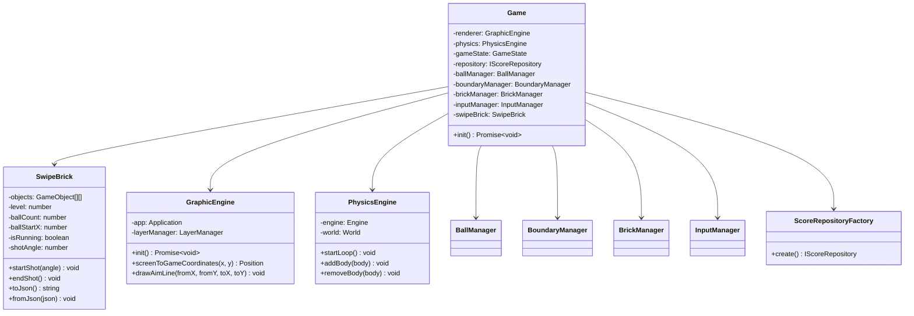
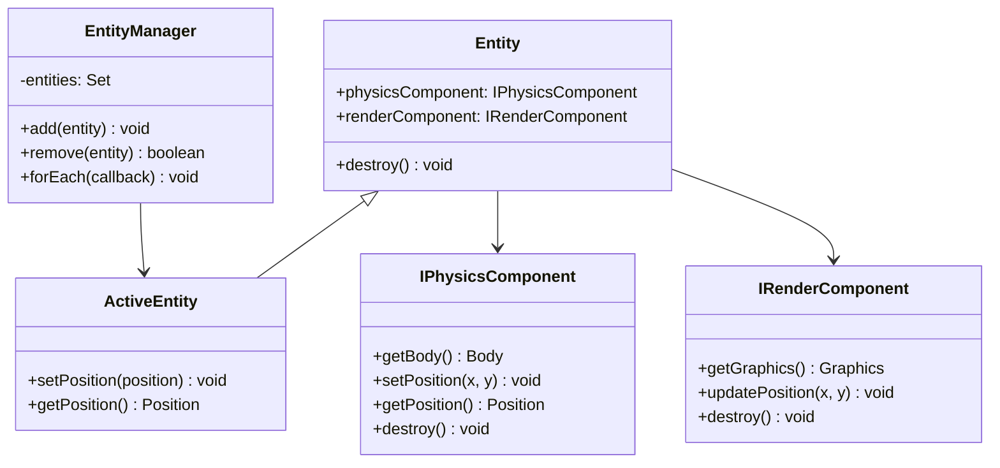

# 스와이프 벽돌깨기

앱인토스에 출시한 모바일 웹뷰 기반 스와이프 벽돌깨기 게임입니다. PixiJS와 Matter.js를 사용해 게임 렌더링, 물리 시뮬레이션, 입력 좌표계, 상태 저장 구조를 설계했습니다.

- 기간: 2025.10 ~ 2025.11 개발, 현재 서비스 유지
- 형태: 팀 프로젝트
- 담당: 기획 및 프론트엔드 전반
- 앱 주소: https://minion.toss.im/jj1gToap (모바일 전용)
- 기술 스택: PixiJS, Matter.js, TypeScript, React, Vite, Emotion

## 문제 정의

스와이프 벽돌깨기는 공의 이동과 충돌 결과가 곧 점수로 이어지는 게임입니다. 따라서 화면에 보이는 연출뿐 아니라 물리 결과의 일관성, 진행 상태의 재현성, 모바일 웹뷰 환경의 입력/레이아웃 안정성이 중요했습니다.

개발 과정에서 중점적으로 다룬 문제는 다음과 같습니다.

- FPS 변동이나 프레임 드랍이 물리 공간의 시간 흐름을 바꾸지 않도록 제어
- 빠르게 움직이는 공에서 발생하는 터널링, 중복 충돌, 벽에 붙는 현상 완화
- PixiJS 캔버스와 React UI가 같은 게임 좌표계를 기준으로 동작하도록 통합
- Toss 앱, Android WebView, 일반 브라우저에서 점수와 게임 상태를 저장할 수 있도록 저장소 분리
- 공 꼬리 궤적, 파편 효과 등 게임 화면의 피드백을 PixiJS로 직접 구현

## 주요 기능

- 스와이프 기반 조준선 표시 및 공 발사
- 레벨에 따라 내려오는 벽돌과 공 추가 아이템
- 여러 공의 순차 발사, 착지 위치 계산, 다음 턴 시작 위치 갱신
- 최고 점수 저장 및 앱인토스 랭킹 제출
- 진행 중 게임 상태 저장 및 복원
- 모바일 웹뷰 safe area, DPR, 터치 좌표 보정

## 게임 구조

`Game`은 렌더링, 물리, 입력, 벽돌, 공, 저장소를 조립하는 진입점입니다. 게임 규칙은 `SwipeBrick`, 렌더링은 `GraphicEngine`, 물리 시뮬레이션은 `PhysicsEngine`, 점수/상태 저장은 `ScoreRepository` 계층으로 분리했습니다.



## 기술적으로 신경 쓴 부분

### 1. 고정 타임스텝 기반 물리 루프

안드로이드 웹뷰 환경에서는 저전력 모드, 백그라운드 복귀, 프레임 드랍 등으로 `requestAnimationFrame` 간격이 흔들릴 수 있습니다. 프레임 간격을 그대로 Matter.js에 넘기면 FPS에 따라 물리 공간의 시간이 달라지고, 같은 발사 각도에서도 다른 결과가 나올 수 있습니다.

이를 줄이기 위해 `PhysicsEngine`에서 rAF 기반 누적 시간 루프를 만들고, 고정된 단위 시간으로 `Engine.update`를 반복 실행했습니다. 또한 과도한 지연은 200ms로 제한해 긴 프레임 드랍 이후 물리 업데이트가 한 번에 몰리는 상황을 방어했습니다.

```ts
const MAX_ACC = 200;
let delta = now - last;
if (delta > MAX_ACC) delta = MAX_ACC;

acc += delta;
const substepsToRun = Math.floor(acc / SUB_DT);

for (let i = 0; i < substepsToRun; i++) {
  Engine.update(this.engine, SUB_DT);
}
```

### 2. Matter.js 충돌 보정

빠르게 움직이는 공이 벽돌 경계에 닿을 때 터널링, 중복 충돌, 비정상 반사가 발생했습니다. 이를 완화하기 위해 다음 처리를 적용했습니다.

- Matter.js position/constraint iteration 조정
- `_restingThresh` 값을 조정해 공이 벽에 붙는 현상 완화
- 충돌 전 공의 속도를 저장하고, 두 벽돌에 동시에 닿은 경우 이전 속도 기준으로 반사 방향 보정
- 수평에 가까운 각도를 금지 구간으로 두고 가장 가까운 유효 각도로 보정

이 처리는 공의 이동이 많은 벽돌깨기 게임에서 플레이 결과가 불안정하게 흔들리는 문제를 줄이기 위한 장치입니다.

### 3. 엔티티 기반 렌더링/물리 분리

게임 오브젝트는 물리 컴포넌트와 렌더 컴포넌트를 갖는 엔티티로 다룹니다. 매니저는 공, 벽돌, 경계, 입력처럼 역할별 책임을 나누고, 각 엔티티는 생성 후 물리 결과에 따라 렌더링 위치가 갱신됩니다.

이 구조 덕분에 PixiJS 화면 객체와 Matter.js 물리 객체가 한 클래스에 강하게 섞이지 않고, 게임 규칙과 화면 표현을 분리해서 다룰 수 있었습니다.



### 4. 공 꼬리 궤적 애니메이션

공의 이동 경로를 보여주기 위해 PixiJS `Graphics`로 꼬리 궤적을 구현했습니다. 처음에는 하나의 fill로 꼬리를 만들었을 때 도형이 겹치는 구간에서 구멍이 생기는 문제가 있었습니다.

이를 해결하기 위해 꼬리를 여러 다각형 조각으로 나누어 그리고, 각 조각에 개별 fill을 적용했습니다. 색상 보간은 sRGB 값을 그대로 섞으면 중간색이 어둡게 보이기 때문에 Linear RGB로 변환한 뒤 보간하고 다시 sRGB로 되돌리는 방식으로 처리했습니다.

### 5. 모바일 웹뷰 좌표계 통합

PixiJS 캔버스와 React UI가 함께 올라가는 구조이기 때문에, 터치 좌표와 게임 좌표가 어긋나면 조준선과 실제 발사 방향이 다르게 보일 수 있습니다.

`GraphicEngine`에서 캔버스의 DOM 위치, PixiJS resolution, `devicePixelRatio`, center layer의 scale/pivot을 반영해 화면 좌표를 게임 좌표로 변환했습니다. 또한 앱 환경에 따라 safe area 값을 적용해 모바일 웹뷰에서 화면이 잘리지 않도록 처리했습니다.

### 6. 실행 환경별 저장소 분리

점수와 진행 상태 저장 방식은 실행 환경에 따라 다릅니다. `ScoreRepositoryFactory`에서 Android WebView, Toss 앱, 일반 브라우저를 구분하고, 각각 AndroidBridge, 앱인토스 Storage, localStorage 기반 구현을 선택하도록 분리했습니다.

```ts
if (typeof window.AndroidBridge !== "undefined") {
  return new AndroidWebViewRepository();
}

if (isTossApp()) {
  return new TossAppScoreRepository();
}

return new LocalStorageScoreRepository();
```

## 폴더 구조

```txt
src
├── core/entity        # 엔티티와 엔티티 매니저
├── entity             # 공, 벽돌, 아이템, 경계 엔티티
├── physics            # Matter.js 기반 물리 엔진과 물리 컴포넌트
├── render             # PixiJS 렌더링 엔진, 레이어, 렌더 컴포넌트, 이펙트
├── managers           # 공/벽돌/입력/경계/사운드 매니저
├── repository         # 점수와 게임 상태 저장소
├── components         # React 기반 UI
├── stores             # Zustand UI 상태
└── utils              # 좌표, 색상, 플랫폼, i18n 등 유틸리티
```

## 실행 방법

```bash
npm install
npm run dev
```

빌드:

```bash
npm run build
```

앱인토스 배포:

```bash
npm run deploy
```

## 참고

앱인토스 링크는 모바일 환경에서 열어야 정상적으로 확인할 수 있습니다.
