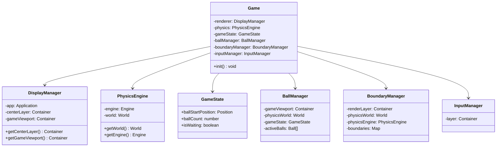
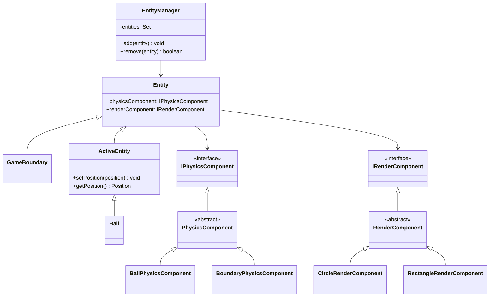

# swipebrick

스와이프 벽돌깨기

https://vercel.com/ohyuchans-projects/swipebrick

```mermaid
classDiagram
direction TB
    class Game {
	    -renderer: DisplayManager
	    -physics: PhysicsEngine
	    -gameState: GameState
	    -ballManager: BallManager
	    -boundaryManager: BoundaryManager
	    -inputManager: InputManager
	    +init() void
    }
    class DisplayManager {
	    -app: Application
	    -centerLayer: Container
	    -gameViewport: Container
	    +getCenterLayer() Container
	    +getGameViewport() Container
    }
    class PhysicsEngine {
	    -engine: Engine
	    -world: World
	    +getWorld() World
	    +getEngine() Engine
    }
    class GameState {
	    +ballStartPosition: Position
	    +ballCount: number
	    +isWaiting: boolean
    }
    class BallManager {
	    -gameViewport: Container
	    -physicsWorld: World
	    -gameState: GameState
	    -activeBalls: Ball[]
    }
    class BoundaryManager {
	    -renderLayer: Container
	    -physicsWorld: World
	    -physicsEngine: PhysicsEngine
	    -boundaries: Map
    }
    class InputManager {
	    -layer: Container
    }

    Game --> DisplayManager
    Game --> PhysicsEngine
    Game --> GameState
    Game --> BallManager
    Game --> BoundaryManager
    Game --> InputManager

```

```mermaid
classDiagram
direction TB
    class Ball {
    }

    class GameBoundary {
    }

    class EntityManager {
	    -entities: Set
	    +add(entity) void
	    +remove(entity) boolean
    }

    class Entity {
	    +physicsComponent: IPhysicsComponent
	    +renderComponent: IRenderComponent
    }

    class ActiveEntity {
	    +setPosition(position) void
	    +getPosition() Position
    }

    class PhysicsComponent {
    }

    class BallPhysicsComponent {
    }

    class BoundaryPhysicsComponent {
    }

    class RenderComponent {
    }

    class CircleRenderComponent {
    }

    class RectangleRenderComponent {
    }

    class IPhysicsComponent {
    }

    class IRenderComponent {
    }

	<<abstract>> PhysicsComponent
	<<abstract>> RenderComponent
	<<interface>> IPhysicsComponent
	<<interface>> IRenderComponent

    Entity <|-- ActiveEntity
    ActiveEntity <|-- Ball
    Entity <|-- GameBoundary
    PhysicsComponent <|-- BallPhysicsComponent
    PhysicsComponent <|-- BoundaryPhysicsComponent
    RenderComponent <|-- CircleRenderComponent
    RenderComponent <|-- RectangleRenderComponent
    EntityManager --> Entity
    Entity --> IPhysicsComponent
    Entity --> IRenderComponent
    IPhysicsComponent <|-- PhysicsComponent
    IRenderComponent <|-- RenderComponent


```
